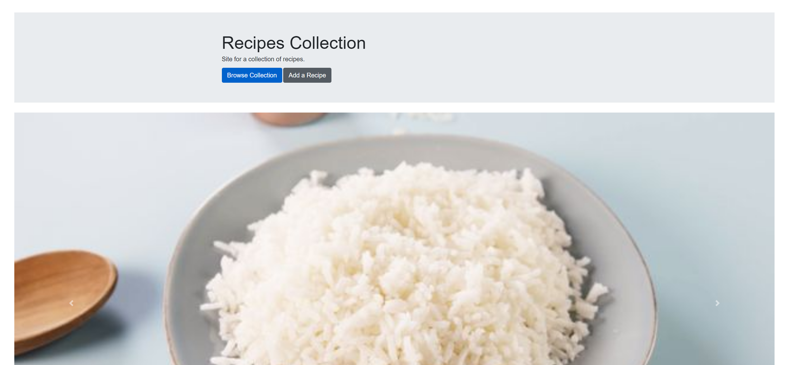
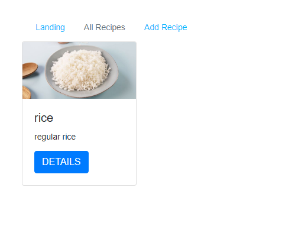
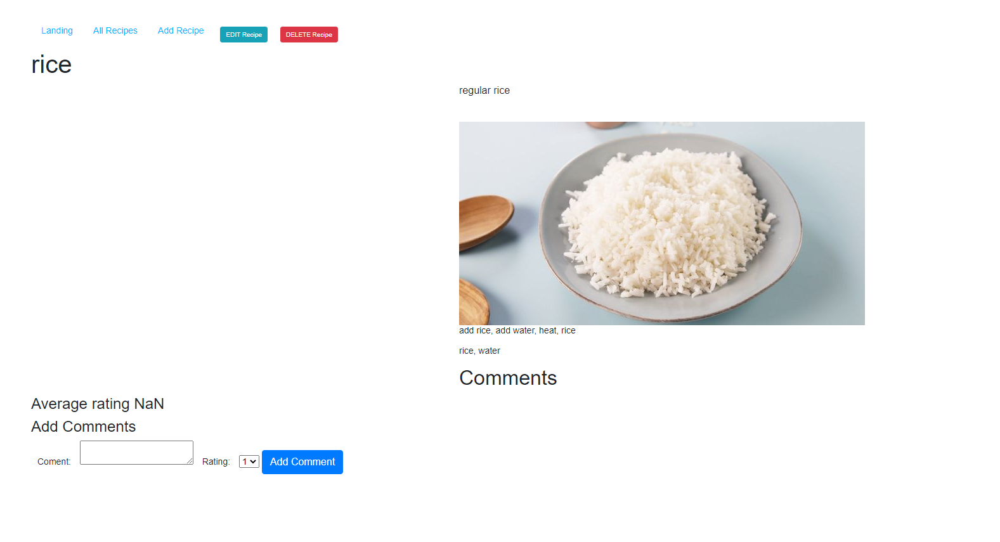
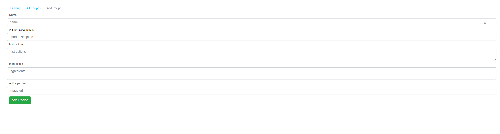

# recipes

<h1> app name: disaster-recipes </h1>

  A simple project to get some experience in creating full stack applications with a back end database and server functionalities.
The purpose of the app is to create an application that have persistent data, therefore a full CRUD functionality

----------

<h2> Screenshots </h2>

 when loading up the page you will see a Landing Page.

The landing page will direct users to two other relevant pages for looking at all the recipes in the database, or go straight to adding a new entry.

 after clicking on the browse collection button, users will be directed to a page where all the recipes in the data base is being showcased.
  
  Each recipe is in a card form, with its user uploaded picture and some simple descriptions. A details button is available for every recipe.
  
  The details button will direct the user to the specific recipe page.

 The details page of a recipe will show the full recipe. 
  
  name of the recipe,
  
  a short description of the recipe,
  
  picture of the recipe, if the user linked a valid URL,
  
  full instruction of the recipe, a solid block of text,
  
  ingredients used in the recipe.
  
  bottom of the page there is a comment section, where users can give a rating from 1 to 5 and leave a comment. 
  
  the comments will show up a the bottom of the page, and the average rating will dynamically update, to the nearest 10th(?) decimal
  
  the recipe can be immediately deleted without comfirmation, destoryed, thrown into the void, without a trace, by click on the red DELETE recipe button,
  
  the edit feature is not implemented,
  
  comments can be deleted, but only the top most comment will be gone, regardless of which delete comment button is clicked (its a feature! i swear!).

  

  

 The add recipe page lets users to add entries to the database,
  
  there are no restrictions to any of the input fields (fragile, handle with care),
  
  the input fields should be very self explainatory,
  
  clicking the add recipe button will take the user to the show collection page where the recipe will show up.

  

  
----------

<h2> Technologies used </h2>
<ul>
  <li>JavaScript</li>
  <li>HTML</li>
  <li>CSS</li>
  <li>tech stack: MEN - CRUD app</li>
  <li>NodeJS</li>
  <li>ExpressJS</li>
  <li>MongoDB</li>
  <li>Mongoose</li>
  <li>BootStrap</li>
  <li>JQuery</li>
  <li>Heroku</li>
  <li>Postman</li>
</ul>

----------
<a href="https://disaster-recipes.herokuapp.com/"> Deployed on Heroku, painfully. </a>
----------
<h2> Planned Features </h2>
<a href="https://trello.com/b/4ISflH13/project-management"> See trello board. </a>
